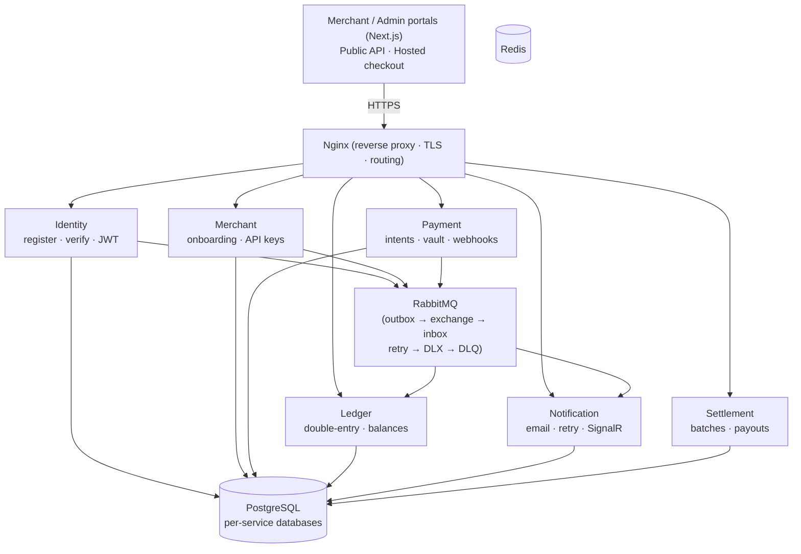

# Real-Time Payment Switch

[](https://github.com/Emmanuel-Ejeagha/Payment-switch/actions/workflows/ci-cd.yml)
[](https://github.com/Emmanuel-Ejeagha/Payment-switch/actions/workflows/security.yml)
[](LICENSE)

A production-grade, full-stack payment processing platform built with **.NET 10** microservices,
**PostgreSQL**, **RabbitMQ**, **Redis**, and **Next.js** storefronts. It implements the core backend of
processors like Stripe, Flutterwave, and Paystack: merchant onboarding, payment intents with
authorize/capture/void/refund semantics, idempotency, a double-entry ledger, nightly settlement with
ledger tie-out, real-time merchant notifications, and transactional email verification.

> **Scope note:** this is a portfolio/demonstration system engineered to production standards
> (tested, observable, documented, reproducibly deployable). It is not a licensed financial
> institution, and no claim is made about PCI, SOC 2, or other regulatory compliance.

## Live Deployment

The stack runs on **AWS EC2** via Docker Compose:

| Surface | URL |
|---|---|
| Merchant portal | http://16.171.58.173/ |
| Admin portal | http://16.171.58.173/admin/login |
| API health (example) | http://16.171.58.173/identity/health/live |

Swagger UI is served in Development only and denied at the edge in production —
see `docs/prod-exposure.md`. Integrator API docs live in `docs/api-reference.md` and `docs/webhooks.md`.

*(The EC2 instance stops automatically when credits run out, but you can always restart it —
or run the whole stack locally, see "Local endpoints" below.)*

## Features

- **Merchant lifecycle** — onboarding with approval workflow (`Pending → Approved/Rejected → Active ⇄ Suspended`),
  settlement/bank info, webhook configuration with encrypted signing secrets and dual-secret grace rotation,
  per-environment API keys (`sk_live_` / `sk_test_`).
- **Payments API** — payment intents with a guarded state machine (authorize, capture incl. partial,
  void, refund), idempotency keys with conflict detection and concurrent-create convergence, card-token
  vault, hosted checkout, payment links, subscriptions/invoices with recurring billing, signed outbound
  webhooks with freshness checks and per-IP failure throttling.
- **Double-entry ledger** — integer minor-unit money, immutable journal entries, per-currency merchant
  balances (available/pending/reserved), optimistic concurrency, crash-safe idempotent posting,
  periodic reconciliation with admin reports.
- **Settlement** — nightly (Hangfire) + on-demand per-currency batches with pre-completion ledger tie-out,
  duplicate-batch protection, payout rows.
- **Notifications** — email (SMTP + Resend), SMS stub (explicitly disabled), webhooks, merchant contact
  resolution, opt-in/opt-out preferences, SignalR real-time fan-out to both portals, retry with exponential
  backoff and dead-letter recording.
- **Email verification** — CSPRNG tokens (SHA-256 at rest, single-use, expiring, rotated on resend),
  event-driven delivery (Identity outbox → Notification → Resend), enumeration-safe resend with cooldown
  and 429 throttling, constant-time hash comparison.
- **Identity & access** — registration, login with short-lived JWT + rotating refresh tokens (reuse
  detection, per-user caps, pruning), password reset/change with session revocation, account lockout
  (5 attempts / 15 min), RBAC (`Admin`, `Merchant`, `Support`), dedicated inter-service tokens.
- **Operations** — structured JSON logging (Serilog), OpenTelemetry tracing (Jaeger), Prometheus metrics
  + alerts (Alertmanager), provisioned Grafana dashboards, nightly Postgres backups with restore drills.

## Architecture

Domain-Driven Design, CQRS, and event-driven messaging with a transactional outbox/inbox backbone:



Request flow for a payment: `Merchant portal → Payment API → outbox → RabbitMQ → Ledger (reserve/capture) + Notification (email/SignalR) → Settlement (nightly tie-out and payout)`.

All services follow Clean Architecture (`Domain → Application → Infrastructure → API`) over a shared
kernel (`src/BuildingBlocks`). Cross-service contracts: REST/OpenAPI at the edge, versioned gRPC
internally, RabbitMQ domain events between bounded contexts (see `docs/messaging-registry.md`).

## Services

| Service | Database | Responsibilities |
|---|---|---|
| **Identity** | `IdentityDb` | Registration + Resend email verification, login + JWT/refresh rotation, password reset/change, lockout, RBAC, admin roles |
| **Merchant** | `MerchantDb` | Onboarding + approval lifecycle, settlement/bank info, webhook secrets (encrypted), API keys |
| **Payment** | `PaymentDb` | Intent lifecycle (authorize/capture/void/refund, partials, expiry), idempotency, secret-key public API, card-token vault, payment links, checkout, subscriptions/invoices, signed webhooks |
| **Ledger** | `LedgerDb` | Double-entry journal, per-currency balances, idempotent posting, reconciliation reports |
| **Notification** | `NotificationDb` | Email (SMTP/Resend) / SMS / webhook dispatch with retry + DLQ, templates, preferences, SignalR |
| **Settlement** | `SettlementDb` | Nightly + on-demand per-currency batches, ledger tie-out, payouts (Hangfire) |

## Technology Stack

| Category | Technologies |
|---|---|
| **Backend** | .NET 10, ASP.NET Core, EF Core, PostgreSQL 16, Redis 7, RabbitMQ 3, Hangfire, gRPC |
| **Frontend** | Next.js (App Router), TypeScript strict, Tailwind CSS, SignalR client |
| **Testing** | xUnit + Moq, Testcontainers (real Postgres/RabbitMQ), k6 (smoke/load/soak), Playwright (E2E), Vitest |
| **Auth** | JWT + refresh rotation, API keys (bcrypt-hashed), service tokens, RBAC |
| **Validation** | FluentValidation (server), Zod + React Hook Form (client) |
| **Observability** | Serilog, OpenTelemetry + Jaeger, Prometheus + Alertmanager, Grafana |
| **Delivery** | Docker + Compose (live runtime), Kubernetes manifests + Helm chart (implemented, not the live runtime), GitHub Actions |

## Getting Started

### Prerequisites

- [.NET 10 SDK](https://dotnet.microsoft.com/download/dotnet/10.0)
- [Docker Desktop](https://www.docker.com/products/docker-desktop/) (Engine + Compose v2)
- [Node.js 22+](https://nodejs.org/) (for the Next.js portals)
- [Git](https://git-scm.com/)

### Run the whole stack

```bash
git clone https://github.com/Emmanuel-Ejeagha/Payment-switch.git
cd Payment-switch

# 1. Create your .env from the template. Leave RESEND_API_KEY empty for local
#    development (verification mail is simulated in logs, dev only). Set it —
#    plus a verified sender domain (see docs/runbook.md §7) — for real delivery.
cp .env.example .env   # then fill in secrets (openssl rand -base64 32)

# 2. Start everything (migrations run automatically on service startup)
docker compose up -d --build
docker compose ps          # wait until all services report healthy
```

Verify:

```bash
curl -fsS http://localhost/identity/health/live     # via nginx
bash infra/smoke/compose-smoke.sh                   # per-API health + metrics matrix
```

For production TLS termination, overlay the TLS config (see `docs/tls.md`):

```bash
docker compose -f docker-compose.yml -f docker-compose.prod.yml up -d
```

### Ports (host → container)

| Surface | Address |
|---|---|
| Nginx (only public ingress) | `http://localhost` (`:80`, `:443` in prod overlay) |
| Merchant portal | `http://localhost/` |
| Admin portal | `http://localhost/admin/login` |
| APIs (loopback only) | `127.0.0.1:5146` identity, `:5237` merchant, `:5118` payment, `:5320` ledger, `:5281` notification, `:5392` settlement → container `:8080` |
| RabbitMQ mgmt / metrics | `127.0.0.1:15672` / `:15692` (loopback only) |
| Postgres | `127.0.0.1:5432` (loopback only) |

### Local endpoints (no AWS needed)

If the EC2 instance is stopped, the entire system runs on any machine with Docker —
no cloud account required. Start the stack as above, then use it exactly like production:

| What | Where (local) |
|---|---|
| Merchant portal (register, verify email, dashboard, checkout) | `http://localhost/` |
| Admin portal (login) | `http://localhost/admin/login` |
| Identity API + Swagger UI (dev) | `http://127.0.0.1:5146` → `/swagger`, `/health/live` |
| Merchant API + Swagger UI (dev) | `http://127.0.0.1:5237` → `/swagger`, `/health/live` |
| Payment API + Swagger UI (dev) | `http://127.0.0.1:5118` → `/swagger`, `/health/live` |
| Ledger API + Swagger UI (dev) | `http://127.0.0.1:5320` → `/swagger`, `/health/live` |
| Notification API + Swagger UI (dev) | `http://127.0.0.1:5281` → `/swagger`, `/health/live` |
| Settlement API + Hangfire (dev, admin-gated) | `http://127.0.0.1:5392` → `/swagger`, `/health/live`, `/hangfire` |
| RabbitMQ management (user/pass from `.env`) | `http://127.0.0.1:15672` |

First login: use the seeded admin (`SEED_ADMIN_EMAIL`, default `admin@paymentswitch.com`)
with the `SEED_ADMIN_PASSWORD` from your `.env`. To try the full money flow locally, register a
merchant account in the portal, verify it, create an API key, and drive the E2E suite
(`tests/Integration/E2E.IntegrationTests`) — it exercises register → verify → onboard →
authorize → capture → ledger → notification → settlement against real containers.

Verifying without Resend configured: the verification link is not emailed (nothing leaves your
machine). Grab the single-use token from the Identity outbox and open the link yourself:

```bash
docker compose exec -T postgres psql -U paymentswitch -d IdentityDb -t -c \
  "SELECT \"Payload\"->>'Token' FROM \"OutboxMessages\" WHERE \"EventType\"='EmailVerificationRequestedDomainEvent' ORDER BY \"OccurredOn\" DESC LIMIT 1;"
# then visit: http://localhost/verify-email?email=<your-email>&token=<token-from-above>
```

Notes:

- Grafana, Prometheus, Jaeger, and Redis expose no host ports — they are internal-only.
  Reach them with `docker compose exec` or a temporary `ports:` override, never by publishing
  them in a shared environment.
- Verification email is simulated in server logs until `RESEND_API_KEY` (plus a verified sender
  domain) is configured — see `docs/runbook.md` §7.

## Configuration

All secrets come from the environment (`.env` locally, gitignored, fail-fast on missing values;
managed secret store + rotation scripts in production — see `docs/secrets.md`). Key variables:

| Variable | Used by | Purpose |
|---|---|---|
| `JWT_SECRET` / `JWT_PREVIOUS_SECRET` | all APIs | JWT signing (+ rotation window) |
| `SERVICE_TOKEN_SECRET` | all APIs | Inter-service auth (must differ from `JWT_SECRET`) |
| `POSTGRES_PASSWORD` | postgres + APIs | Database password |
| `RABBITMQ_DEFAULT_USER/PASS` | rabbitmq + APIs | Broker credentials |
| `SEED_ADMIN_EMAIL/PASSWORD` | identity | Bootstrap admin (first startup only) |
| `WEBHOOK_SECRET_ENCRYPTION_KEY` | merchant | Webhook-secret encryption at rest |
| `RESEND_API_KEY/…` | notification | Resend delivery (empty = dev simulation) |
| `FRONTEND_BASE_URL` | identity, notification, frontends | Trusted link/API origin (https in prod) |
| `EMAIL_VERIFICATION_RESEND_COOLDOWN_SECONDS` | identity | Resend throttle window (default 60) |
| `CORS_ALLOWED_ORIGINS` | all APIs | Browser origins (real HTTPS origins in prod) |
| `GRAFANA_ADMIN_PASSWORD` | grafana | Dashboards admin |

## Testing

```bash
# Unit tests (one project at a time)
dotnet test tests/Unit/Payment.Application.Tests/Payment.Application.Tests.csproj -c Release

# Integration tests (need Docker running; one project at a time — Testcontainers)
dotnet test tests/Integration/Ledger.API.IntegrationTests/Ledger.API.IntegrationTests.csproj -c Release

# Cross-service E2E (register → verify → onboard → authorize → capture → ledger → notification → settlement)
dotnet test tests/Integration/E2E.IntegrationTests/E2E.IntegrationTests.csproj -c Release

# Frontend (per app in apps/merchant, apps/admin)
npm run typecheck && npm run lint && npm run test && npm run build

# Load (k6; staging only) and browser E2E
k6 run tests/Performance/k6-smoke.js
npx playwright test
```

## Deployment & Operations

- **Compose (live):** `docker compose up -d --build` on the EC2 host; rolling single-service
  updates via `docker compose up -d <service>`; Postgres backups + restore drills (see `docs/runbook.md` §3).
- **Kubernetes/Helm:** manifests in `k8s/`, chart in `helm/payment-switch` — implemented, CI-validated
  (`helm lint`/`template`, kubeconform), but **not** the live runtime.
- **CI/CD** (`.github/workflows/`): build + `dotnet format` gate + NuGet audit, unit tests with coverage,
  sequential Testcontainers integration suites, frontend typecheck/lint/test/build, manifest validation,
  Docker build/push with Trivy scans, CodeQL + Gitleaks + secret scanning, gated production deploy with
  rollback, nightly E2E + k6.
- **Runbooks:** `docs/runbook.md` (operations, TLS, backups, incidents, Resend setup + smoke test),
  `docs/deployment.md` (k8s/CI-CD), `docs/secrets.md` (storage + rotation), `docs/tls.md`.
- **Health & metrics:** each API exposes `/health/live` and `/health/ready`; Prometheus scrapes `/metrics`;
  alert rules live in `infra/prometheus/alerts.yml`.

## Security Posture

- Secrets never committed (`.env`/k8s secrets gitignored, templates only); fail-fast startup validation;
  BCrypt-hashed passwords and API keys; AES-GCM webhook secrets at rest.
- Short-lived JWTs with refresh rotation, reuse detection, per-user caps, and pruning; account lockout;
  server-side authorization on every endpoint; partitioned per-client rate limiting.
- Security headers (incl. HSTS over TLS), CORS allow-listing, request-size limits, correlation IDs.
- Email-verification tokens: CSPRNG, SHA-256 at rest, single-use, expiring, rotated on resend,
  constant-time comparison, enumeration-safe resend, no raw tokens in logs.
- Defense in depth at the edge: only nginx `:80`/`:443` is public; Swagger, metrics, Hangfire, and infra
  UIs are loopback/internal-only (see `docs/prod-exposure.md`).

## Project Structure

```
PaymentSwitch/
├── src/
│   ├── BuildingBlocks/BuildingBlocks.Shared/  # Result, auth, rate limiting, messaging, OTel, …
│   ├── Protos/                                 # gRPC contracts
│   └── Services/{Identity,Merchant,Payment,Ledger,Notification,Settlement}/
│       └── */{*.Domain,*.Application,*.Infrastructure,*.API}
├── apps/
│   ├── merchant/                               # Merchant portal (Next.js, served at /)
│   └── admin/                                  # Admin portal (Next.js, served at /admin)
├── packages/{shared,ui}/                      # Shared TS types/utils + React components
├── tests/
│   ├── Unit/                                   # xUnit suites per service/layer
│   ├── Integration/                            # Testcontainers suites + cross-service E2E
│   └── Performance/                            # k6 smoke/load scripts
├── e2e/                                        # Playwright browser tests
├── k8s/  helm/payment-switch/                 # Kubernetes manifests + Helm chart (not live)
├── infra/                                      # nginx, postgres init, prometheus/grafana, backups, smoke
├── docker-compose.yml                          # Live runtime (+ .prod.yml TLS overlay)
└── docs/                                       # runbook, deployment, tls, secrets, api-reference, …
```

Further documentation: `docs/runbook.md`, `docs/deployment.md`, `docs/tls.md`, `docs/secrets.md`,
`docs/api-reference.md`, `docs/webhooks.md`, `docs/messaging-registry.md`, `docs/prod-exposure.md`,
`docs/roles.md`, `docs/branch-protection.md`, `docs/load-testing.md`, `docs/frontend-tests.md`,
`docs/api-versioning.md`, `docs/RETENTION.md`.

## Contributing

1. Create a feature branch from `main`.
2. Follow the existing Clean Architecture layering and the testing convention (every fix ships with a test:
   unit for pure logic, Testcontainers integration for broker/DB paths).
3. Keep `dotnet format` clean and the full test matrix green before opening a PR.

## License

MIT — see [LICENSE](LICENSE).
